## 一、回顾 Agent

### Agent vs 工作流

*   **工作流 (Workflow)**: 路径是确定的（如 Jenkins Pipeline）。
*   **Agent**: 路径是由 LLM 决定的。

> **LangGraph 的位置**：它是 "Agentic Workflow" —— 在确定的业务逻辑（图结构）中，嵌入不确定的 LLM 决策节点。既有工程的确定性，又有 AI 的灵活性。

### 核心观点

网络上有些人认为，Agent 和 Skill 都是泡沫，最终都会被大模型内化能力所替代（比如 Memory 功能现在已经被很多模型内置）。

其实个人感觉，**通用性 Agent 出现并没有那么容易**，更别提内化成基座模型的能力。

后续几年肯定还是只能让 Agent **局部解决企业内部、具体领域的某些具体问题**，而且特别精细化的工作仍然需要人类（至少是在人类的指导下完成）。

后续几年肯定还是只能让 Agent 局部解决企业内部、具体领域的某些具体问题，而且特别精细化的工作仍然需要人类—— 因此大多数 Agent 做能做到的，仍然只是企业内部某环节的提效。

---

### 二、主流框架
低代码平台如Dify、Coze这种就不讲了。

#### Microsoft AutoGen
2025 年 10 月正式发布。这是微软将 AutoGen（动态多智能体编排）与 Semantic Kernel（企业级生产基础）合并后的统一平台。

**核心哲学**：对话驱动 (Conversation-Driven)
AutoGen 认为："对话就是计算"。
你不需要写复杂的 if-else 流程，只需要定义几个角色：
*   PM (产品经理)：负责提需求。
*   Coder (程序员)：负责写代码。
*   Reviewer (审查员)：负责挑刺。

然后把它们扔进一个群里，它们会自主对话，直到任务完成。

**能力边界与扩展**：

AutoGen **支持**数据库查询和结构化提取，但实现方式与 LangGraph 不同：

1.  **工具调用机制**：
    *   AutoGen 通过 **Semantic Kernel 的 Plugins** 来扩展能力
    *   数据库查询、API 调用、文件操作等都需要封装成"工具"（Tools/Functions）
    *   Agent 在对话过程中自主决定何时调用工具

2.  **数据库连接**：
    *   支持通过 Semantic Kernel Connectors 连接 SQL Server、PostgreSQL、MySQL 等
    *   需要预先定义 SQL 查询模板或使用自然语言转 SQL 的能力
    *   示例：Agent 可以调用 `query_database(user_id=123)` 工具

3.  **结构化提取**：
    *   通过 **Function Calling** 机制实现
    *   LLM 可以返回结构化的 JSON 数据（如提取用户信息、订单详情）
    *   需要预先定义输出 Schema（Pydantic 模型或 JSON Schema）

4.  **与 LangGraph 的对比**：

| 特性 | AutoGen | LangGraph |
| :--- | :--- | :--- |
| **数据库查询** | ✅ 通过工具调用 | ✅ 通过节点函数 |
| **结构化提取** | ✅ 通过 Function Calling | ✅ 通过节点函数 |
| **图像交互** | ✅ 多模态模型（GPT-4V/Claude） | ✅ 通过节点函数调用多模态模型 |
| **表格处理** | ✅ 工具调用/图像模式 | ✅ 通过节点函数（pandas等） |
| **流程控制** | ❌ 完全由对话驱动（不可控） | ✅ 图结构明确定义（可控） |
| **状态管理** | ⚠️ 通过对话历史隐式管理 | ✅ 显式状态对象 |
| **适用场景** | 开放式协作、创意生成、多模态分析 | 企业流程、确定性任务 |

5.  **多模态支持（表格/图像交互）**：

    **图像交互**：
    *   ✅ **完全支持**：AutoGen 集成了 Semantic Kernel，后者支持多模态模型（如 GPT-4V、Claude 3.5 Sonnet）
    *   Agent 可以接收图像输入，进行图像理解、OCR、图表分析等任务
    *   示例场景：
        *   分析截图中的代码错误
        *   理解图表数据并生成报告
        *   识别图片中的对象并执行相关操作

    **表格交互**：
    *   ✅ **支持**：通过多种方式实现
        *   **方式一**：将表格转换为 Markdown/CSV 格式，作为文本输入
        *   **方式二**：使用图像模式，将表格截图发送给多模态模型
        *   **方式三**：通过工具调用，连接 Excel/Google Sheets API
        *   **方式四**：使用专门的表格处理插件（如 pandas、openpyxl）

    **实现示例**：
    ```python
    # AutoGen 中处理图像
    agent_with_vision = ConversableAgent(
        name="vision_agent",
        llm_config={
            "model": "gpt-4-vision-preview",  # 多模态模型
            "max_tokens": 1000,
        }
    )
    
    # 发送图像 + 文本提示
    result = agent_with_vision.generate_reply(
        messages=[{
            "role": "user",
            "content": [
                {"type": "text", "text": "分析这张图表"},
                {"type": "image_url", "image_url": {"url": "https://..."}}
            ]
        }]
    )
    ```

**总结**：AutoGen 的能力边界取决于你为它配置的"工具集"和"模型选择"。它本身不内置数据库查询能力，但通过 Semantic Kernel 的插件生态，可以实现：
*   ✅ 数据库查询（通过工具）
*   ✅ 结构化提取（通过 Function Calling）
*   ✅ **图像理解**（通过多模态模型）
*   ✅ **表格处理**（通过工具或图像模式）

区别在于：
*   **AutoGen**：能力通过"工具"扩展，流程由对话驱动（更灵活但不可控）
*   **LangGraph**：能力通过"节点函数"实现，流程由图结构定义（更可控但需要预先设计）

<!-- 
TODO: 请将你的截图重命名为 agent-vs-workflow.png 
并保存到项目根目录下的 static/images/ 文件夹中 
-->


<!-- 或者使用 Congo 主题的高级图片标签（推荐）： -->


---

## 三、LangGraph 工作流示例解析

### 工作流架构图



### 流程节点解析

这是一个典型的 **LangGraph Agentic Workflow** 实现，展示了如何在确定的图结构中嵌入 LLM 决策节点。

#### 1. 入口：场景选择器 (`scenario_selector`)

**作用**：根据用户输入，由 LLM 判断当前请求的类型。

**三种可能的路径**（虚线箭头表示 LLM 动态决策）：

*   **`is_a_hr_workflow`** → 进入 HR 工作流分支
    *   需要先检索上下文 (`retrieve_context`)
    *   然后创建任务 Agent (`create_task_agent`)
*   **`is_a_scenario`** → 直接进入场景任务
    *   跳过上下文检索，直接创建任务 Agent
*   **`is_a_chat`** → 进入闲聊模式
    *   直接跳转到聊天室 Agent (`run_chatroom_agent`)

**设计亮点**：这是典型的 **"确定性结构 + 不确定决策"** 的体现：
*   结构是确定的（三种路径都已定义）
*   但走哪条路径由 LLM 实时判断

#### 2. 任务执行路径

**`retrieve_context`**（可选）：
*   仅在 HR 工作流场景下执行
*   从知识库/数据库检索相关上下文信息
*   为后续任务 Agent 提供背景知识

**`create_task_agent`**：
*   根据场景类型和上下文，创建专门的任务执行 Agent
*   可能包含工具调用、API 请求等能力

**`run_agent`**：
*   执行任务 Agent 的核心逻辑
*   可能涉及多轮交互、工具调用、状态更新等

#### 3. 回退机制 (`revert_to_chat`)

**设计目的**：当任务 Agent 无法处理或用户意图不明确时，自动降级到闲聊模式。

**触发条件**（由 LLM 判断）：
*   任务执行失败
*   用户意图模糊，需要澄清
*   用户主动要求切换话题

**实现方式**：从 `run_agent` 节点通过 `revert_to_chat` 边跳转到 `run_chatroom_agent`。

#### 4. 聊天室 Agent (`run_chatroom_agent`)

**作用**：处理开放式对话、情感陪伴、信息查询等通用场景。

**特点**：
*   不需要特定的任务上下文
*   可以处理任意话题
*   作为"兜底"方案，确保用户始终能得到响应

### 设计模式总结

这个工作流体现了 LangGraph 的核心设计哲学：

1.  **分层决策**：
    *   第一层：场景选择（`scenario_selector`）
    *   第二层：任务执行（`run_agent`）
    *   第三层：回退降级（`revert_to_chat`）

2.  **优雅降级**：
    *   任务路径失败 → 自动切换到聊天模式
    *   确保用户体验的连续性

3.  **条件路由**：
    *   虚线箭头表示 LLM 动态判断
    *   实线箭头表示确定性的流程流转

4.  **状态管理**：
    *   每个节点可以读取和更新共享状态
    *   Trace ID 贯穿整个流程，支持全链路追踪

### 实际应用场景

这种架构特别适合**企业级智能助手**场景：

*   **结构化任务**（如 HR 流程、工单处理）→ 走任务 Agent 路径
*   **开放式咨询**（如产品介绍、技术支持）→ 走聊天 Agent 路径
*   **模糊意图**（用户说不清楚需求）→ 先走任务路径，失败后降级到聊天路径，通过对话澄清需求


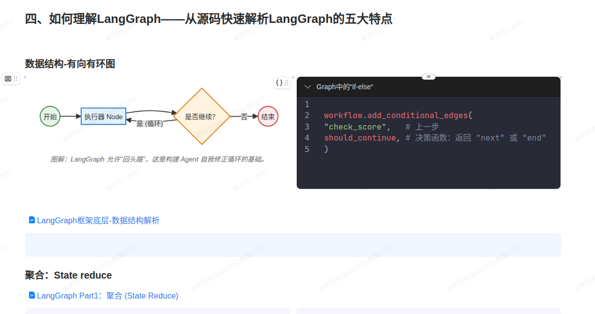 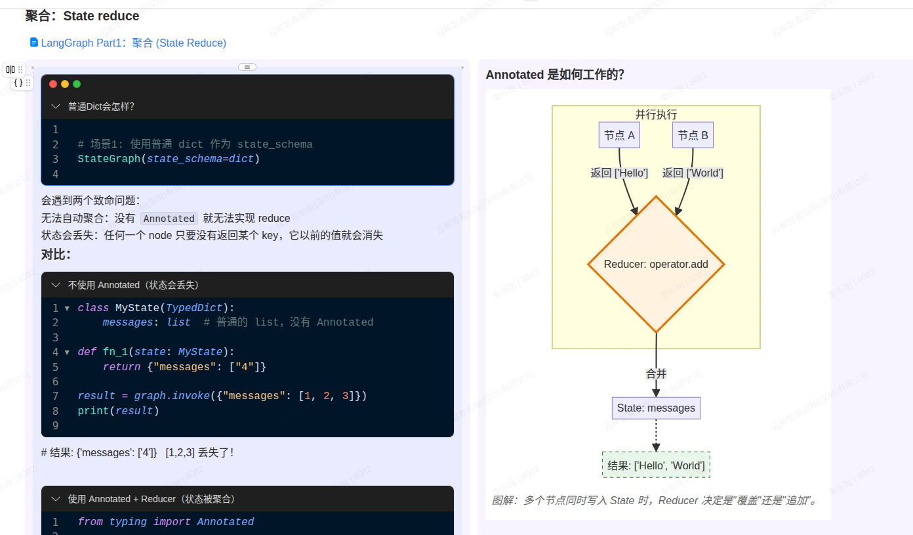 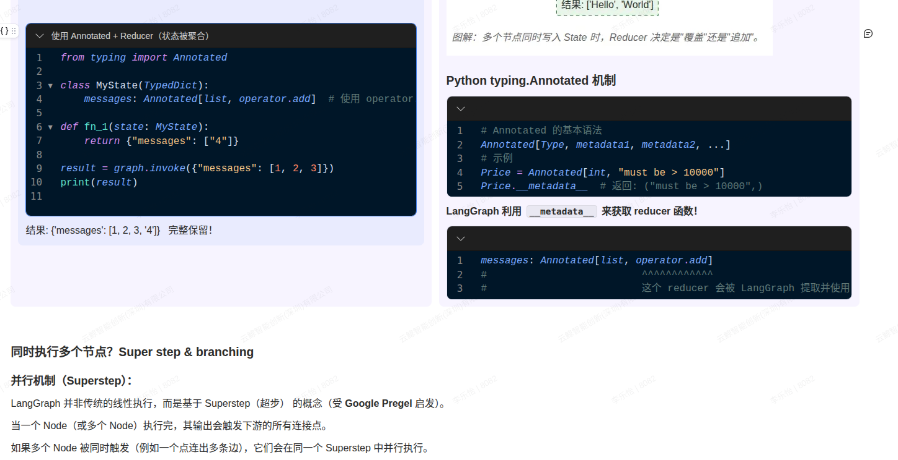 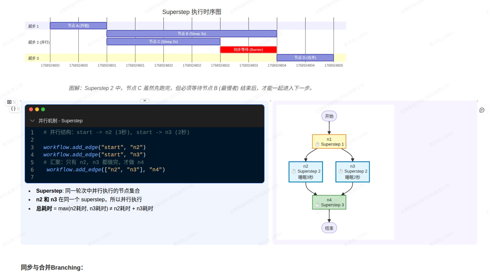 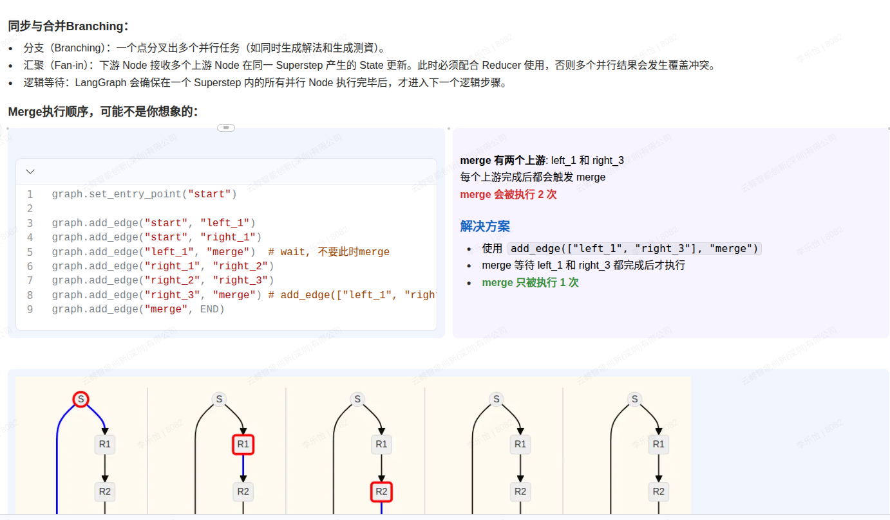 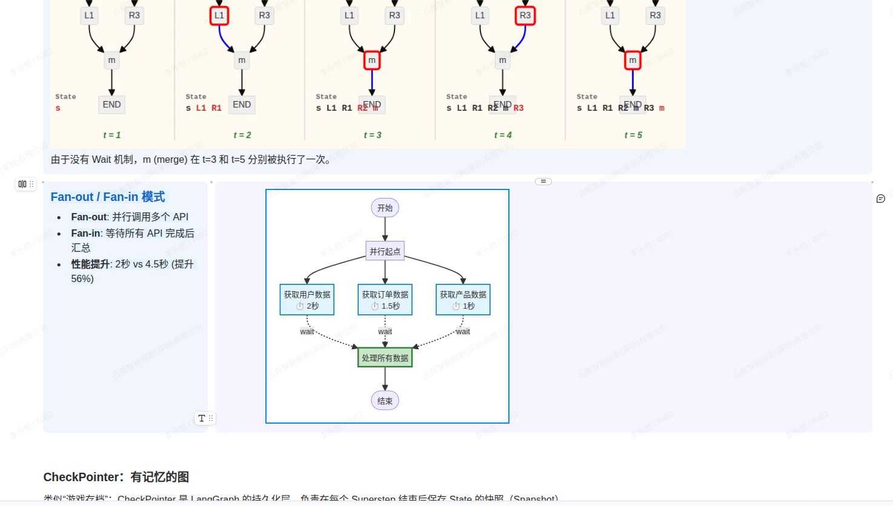 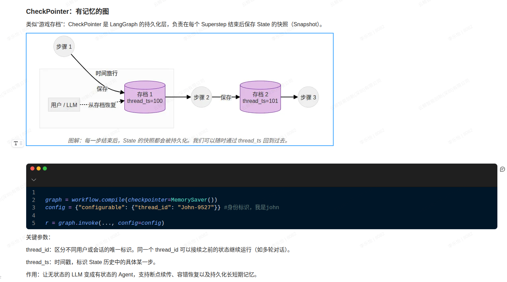 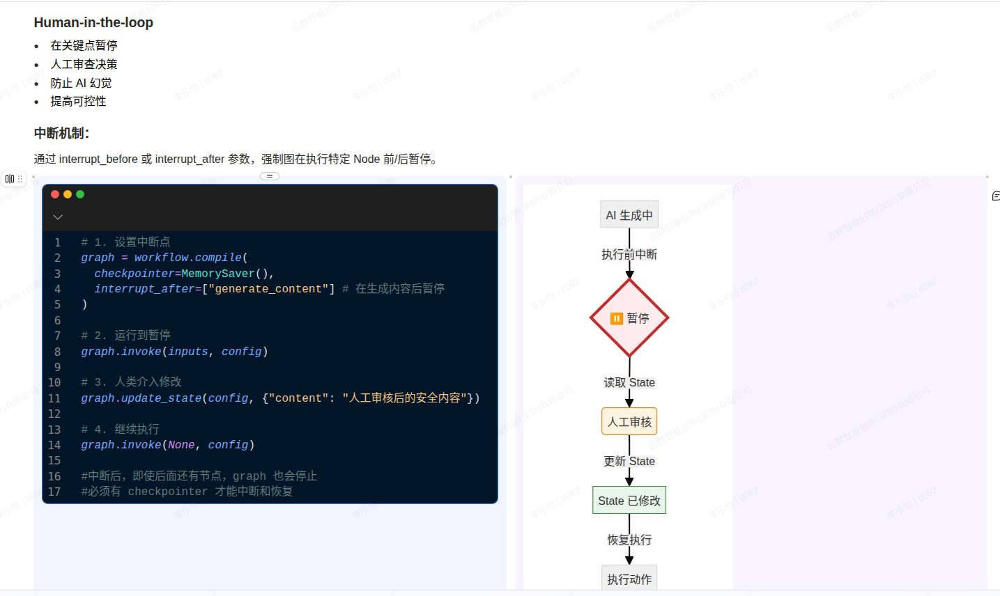 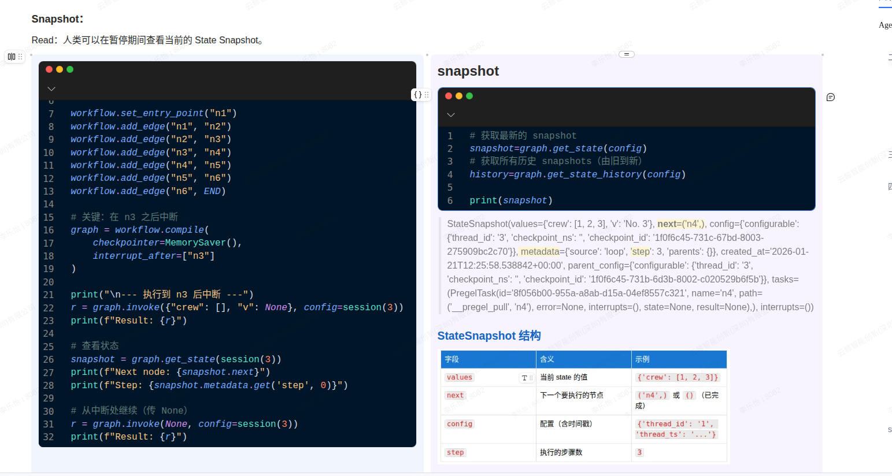  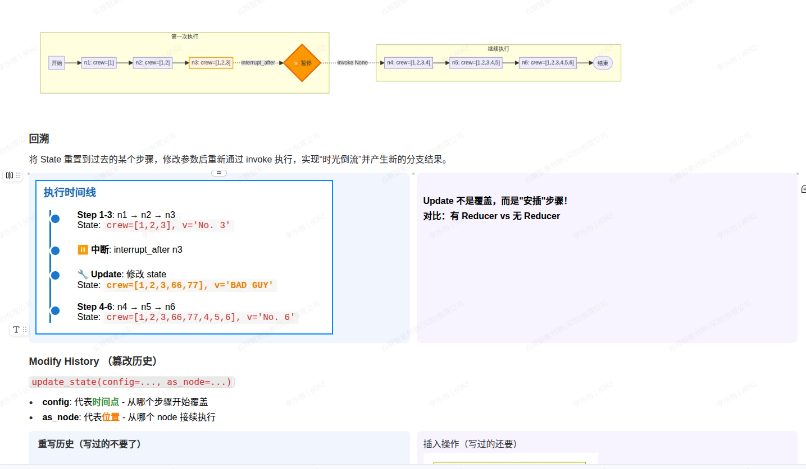 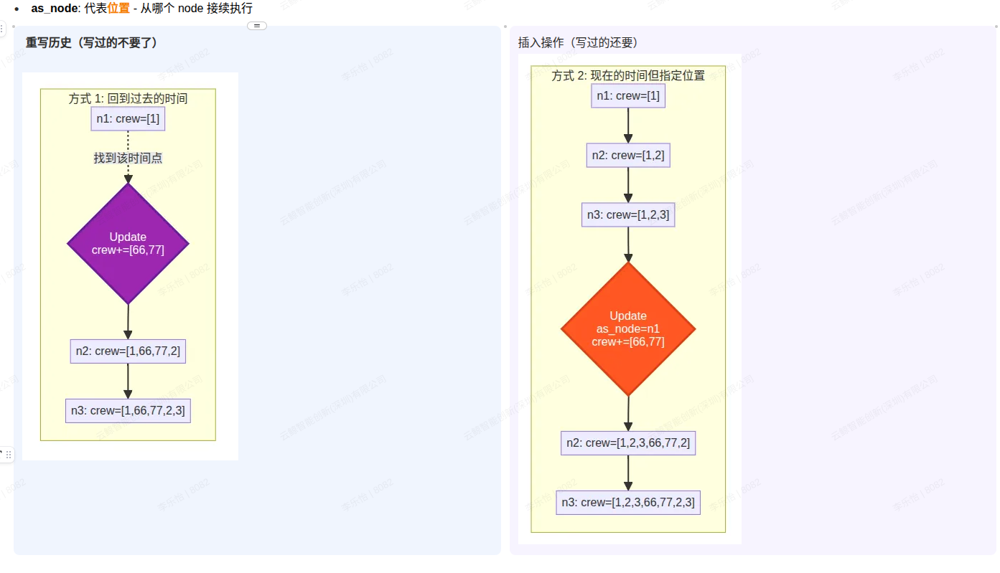